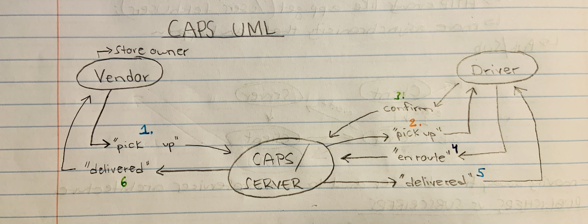

# CAPS - Code Academy Parcel Service

>  Our goal is to setup a system of events and handlers, with the intent being to change out the eventing system as we go, but keeping the handlers themselves largely the same. The task of “delivering a package” doesn’t change (the handler), even if the mechanism for triggering that task (the event) does. (source - Code Fellows Lab 11)

---

The following user/developer stories detail the major functionality for this phase of the project.

    As a vendor, I want to alert the system when I have a package to be picked up
    As a driver, I want to be notified when there is a package to be delivered
    As a driver, I want to alert the system when I have picked up a package and it is in transit
    As a driver, I want to alert the system when a package has been delivered
    As a vendor, I want to be notified when my package has been delivered

  And as developers, here are some of the development stories that are relevant to the above:

    As a developer, I want to use industry standards for managing the state of each package
    As a developer, I want to create an event driven system so that I can write code that happens in response to events, in real time

--- 

## Routes

### /signup

* req, res, next
* JSON response: {"username":"value", "password":"value", "role":"value"}

### /signin

* req, res, next
* JSON response: none
* Authentication: basic (username and password)

### /users

* requires bearer authentication, admin as user "role."

### /secrets

* requires writer, editor, or admin as user "role."

### /api/v2/food

* CRUD depends on user permissions

### /api/v2/clothes

* CRUD depends on user permissions

--- 

## URLs

[Deployed page here](https://timegorov-caps.herokuapp.com)