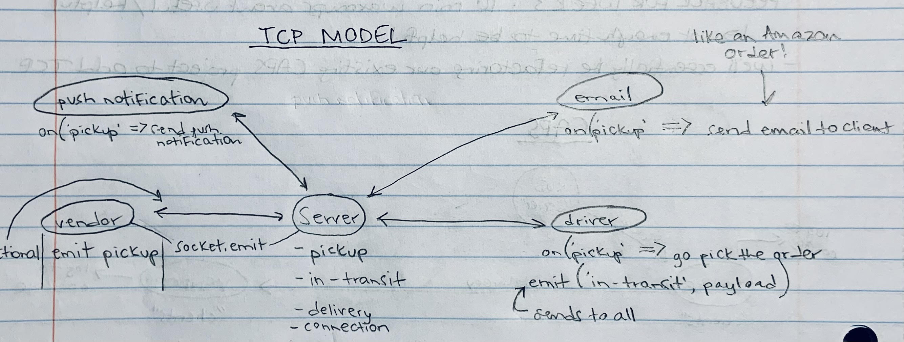

# CAPS - Code Academy Parcel Service

>  Our goal is to setup a system of events and handlers, with the intent being to change out the eventing system as we go, but keeping the handlers themselves largely the same. The task of “delivering a package” doesn’t change (the handler), even if the mechanism for triggering that task (the event) does. 

(source - Code Fellows Lab 11)

---
### Phase 1

The following user/developer stories detail the major functionality for this phase of the project.

    ✔ As a vendor, I want to alert the system when I have a package to be picked up
    ✔ As a driver, I want to be notified when there is a package to be delivered
    ✔ As a driver, I want to alert the system when I have picked up a package and it is in transit
    ✔ As a driver, I want to alert the system when a package has been delivered
    ✔ As a vendor, I want to be notified when my package has been delivered

  And as developers, here are some of the development stories that are relevant to the above:

    ✔ As a developer, I want to use industry standards for managing the state of each package
    ✔ As a developer, I want to create an event driven system so that I can write code that happens in response to events, in real time

### Phase 2

> In Phase 2, we’ll be changing the underlying networking implementation of our CAPS system from using node events to using a library called socket.io so that we can do networked events. Socket.io manages the connection pool for us, makes broadcasting much easier to operate, and works well both on the terminal (between servers) and with web clients.

    By default, all vendors and drivers hear all of the messages…
        Ensure that each vendor only processes pickup and delivered events for it’s own packages!
            Options
                As a vendor, send your vendor id with every pickup, and then when the broadcasted messages come back, ignore those that are not yours
                Setup a separate namespace for each vendor
                Each store will have it’s own “room” within the ‘caps’ namespace

> The expected output of the 3 running applications is the same as it was in Phase 1.

--- 

## URLs

[Deployed page here](https://timegorov-caps.herokuapp.com)

--- 

## Thanks

Thanks to Jacob Knaack, Code Fellows instructor, for walking us through how to write this code. I used his demo code from lecture as a blueprint for writing my code, along with my tests. Some of his comments and code fragments remain, and I have done my best to attribute them where they appear.